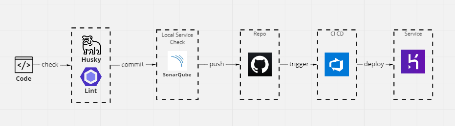

## My react template 🐢
Engineers often need reference kits or examples to work with, so I thought it was time to prepare one of my own.

## About this Project 🤖
This project will be based on the implementation of several modules
1. API anti-corruption layer
2. SSO authentication system (For front-end)
3. Permission routing system
4. i18n module
5. mock data server

## module detail 👀
WIP
## Code Work Flow 🐳
To make my work easier and to ensure the quality of the code, I have designed some processes for this project

* Because I can't find a space where I can deploy Sonarqube without spending money, so I set up a local docker and provided the code scanning service to myself, the cons is that I can't integrate it to the CI of Azure devops 🤣
* I chose Azure devops because I also created work items on it to develop my plans.




## About deploy to heroku 👻
Both heroku and Azure Devops are free and suitable for light use.

Before you use yaml to create your azure devOps pipeline, you will need to set some variables first
* HEROKU_API_KEY : this is your heroku token, generate from heroku CLI 's command ```heroku authorizations:create```
* HEROKU_APP_NAME : this is your heroku app name
